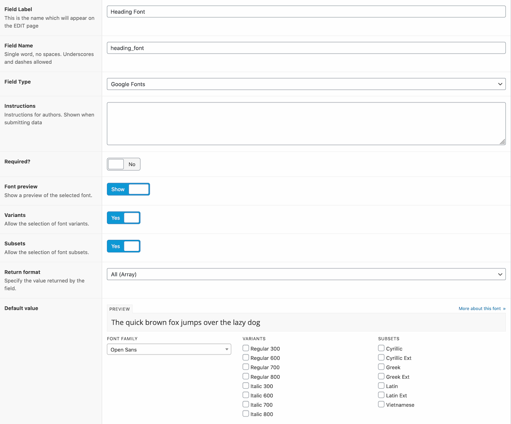
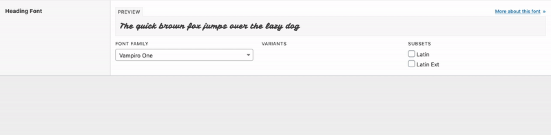

# ACF - Google Fonts Field
A field for Advanced Custom Fields (ACF) allowing users to select fonts from the Google Fonts suite.

This plugin creates a new ACF field that can be used to select fonts from the Google Fonts library using thier [webfonts API](https://developers.google.com/fonts/docs/developer_api).

A local copy of API results are included with the plugin, however, an Google Fonts API key is helpful to update the fonts list automatically.

## Field settings

## Field preview

## Return values
There are 4 returnable values for this field which include:

| Type | Description | Example |
|--|--|--|
| Font family name | Returns the full name of the selected font. | `Open Sans` |
| Selected font variants | Returns an array of selected font variants (if enabled) | `['regular', 'italic', '400']` |
| Selected font subsets | Returns an array of selected font subsets (if enabled) | `['latin', 'latin-ext', 'greek']` |
| CSS import url | A full url for the selected family, variants and subsets for including in CSS. | `https://fonts.googleapis.com/css?family=Mulish:300,500,200italic,300italic&display=swap` |
| All (Array) | An array including all of the above. | `['family' => 'Open Sans', 'variants' => ['regular', 'italic', '400'], 'subsets' => ['latin', 'latin-ext', 'greek']]` |

